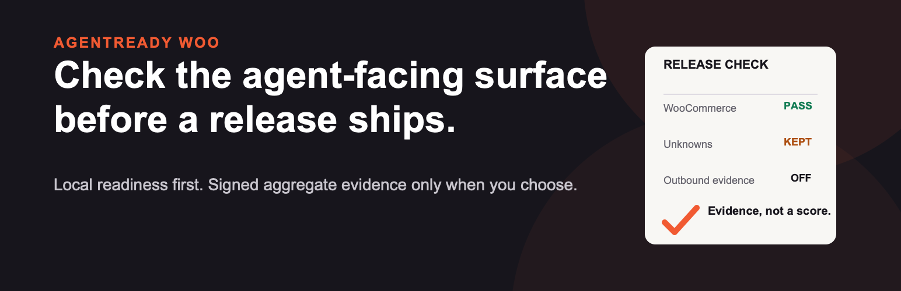

# AgentReady Woo — WooCommerce Release Gate



**Verify the agent-facing WooCommerce surface after a release—without touching
orders, checkout or payment credentials.**

[Run the free public preflight](https://app.utilityhouse.xyz) or add the
dependency-free Node 24 action to a deployment workflow. It fails CI only on an
explicit `HOLD` by default; `BLOCKED`, `UNMEASURED` and `UNREADABLE` remain
visible abstentions.

```yaml
- name: AgentReady Woo preflight
  uses: tytutueh13-sudo/agentready-woo@v1
  with:
    store-origin: https://shop.example
```

### What the release check gives you

- One read-only public preflight for WooCommerce, robots, JSON-LD, MCP, UCP and
  ACP surfaces.
- A finite decision and unknown-reason list instead of a padded readiness score.
- An optional owner-authorized gate fed by signed, aggregate-only WordPress
  evidence.
- No order creation, inventory reservation, checkout mutation or payment access.

Live service: **[app.utilityhouse.xyz](https://app.utilityhouse.xyz)**

AgentReady runs a passive public preflight, then lets a verified store owner
make a version-pinned release decision from signed plugin evidence. A target
that cannot be read returns an abstention rather than a fabricated low score.

This is not a certification, ranking promise or checkout test. The root tools
do not create orders, reserve inventory, send customer email or handle payment
credentials.

## Public MCP tools

`POST https://app.utilityhouse.xyz/mcp` speaks MCP JSON-RPC 2.0 and advertises
five tools. Always use
`tools/list` as the authoritative schema.

| Tool | Use it for |
| --- | --- |
| `scan_woo_store_readiness` | A general public-store audit, score and fix list |
| `preflight_woo_store` | Protocol-family evidence for a specific update or release |

Three additional tools start, read and claim an owner-authorized Release Gate
run. They require a scoped bearer token and verified store ownership.

The general scanner returns `state: UNREADABLE` with `score: null` when it
cannot read the target. Diagnostic accuracy against real merchant stores is
unmeasured. Release Gate settlement is disabled.

## GitHub Action

The repository includes a dependency-free Node 24 action. It calls the same
public preflight contract, writes a reason-coded job summary and fails only on
an explicit `HOLD`. `BLOCKED` and `UNMEASURED` remain abstentions.

Add `families: woo,robots,jsonld,mcp` when the workflow should check only those
four protocol families.

The public endpoint allows three calls per target origin per day and ten calls
per calling IP per day. The action changes nothing on the store.

## WordPress plugin

`wordpress-plugin/agentready-woo` is version 1.2.0. It provides a useful local
readiness snapshot before connection. Activation neither contacts AgentReady
nor creates a schedule. An administrator must make a one-time manual send or
separately opt in to a daily signed aggregate evidence schedule.

The evidence envelope contains version identifiers, opaque store/run fields,
timestamps, nonce, family name and aggregate check state/count. It contains no
customer, order, payment, email, address, product description, URL, credential
or raw log field.

Build the deterministic plugin package with:

```bash
npm run build:plugin
```

Try the local-only snapshot without touching a real store in the
[version-pinned WordPress Playground demo](https://playground.wordpress.net/?blueprint-url=https%3A%2F%2Fraw.githubusercontent.com%2Ftytutueh13-sudo%2Fagentready-woo%2Fv1.2.0%2Fwordpress-plugin%2Fagentready-woo%2Fblueprints%2Fblueprint.json).
The disposable site configures no AgentReady endpoint and sends no evidence.

## REST preflight

`POST https://app.utilityhouse.xyz/api/v2/preflight` is documented in
`mcp-registry/openapi-preflight.yaml`. HTTP 200 does not necessarily mean the
target was measurable; inspect the returned `state` and per-family checks.

## Separate commerce surface

An authenticated account may connect read-only WooCommerce credentials to a
store-bound catalog, offer and signed cart-handoff surface at `/mcp/{store_id}`.
That is a separate product contract and does not grant Release Gate access.
Checkout and payment remain on the merchant's store.

## Development

```bash
npm install
npm run typecheck
npm test
npm run test:wordpress
```

This public repository is a review mirror, not the production deployment
source. Its `wrangler.toml` carries a placeholder database id. Deployment is
performed from the private monorepo.
